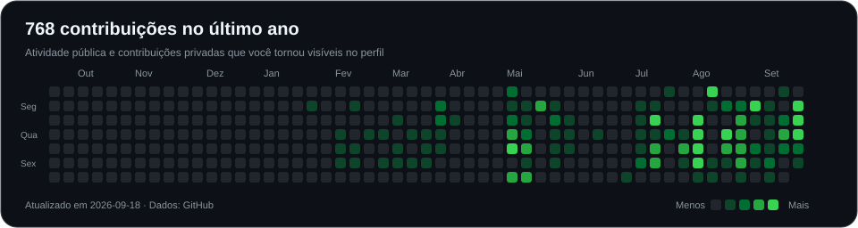

# Gabriel Moura

**Full Stack Developer**

Construo produtos web, SaaS e automações com React, TypeScript, Node.js e IA.

[LinkedIn](https://www.linkedin.com/in/gabrielmouram/) · [Email](mailto:gabrielmouramendes@hotmail.com)

 

### Sobre

Meu trabalho passa pela interface, pelas APIs e pelos dados que sustentam um produto. Costumo lidar com fluxos de gestão, integrações entre serviços e funcionalidades em tempo real. Tenho interesse especial em usar automações e agentes de IA para simplificar o trabalho de quem usa esses sistemas.

 

### Projetos selecionados

#### CRN

ERP para o varejo físico: vendas, estoque, financeiro e emissão fiscal no mesmo fluxo. Uma aplicação multi-tenant para organizar a operação de diferentes negócios.

React · Supabase · PostgreSQL &nbsp; / &nbsp; Repositório privado

 

#### AgentOffice

Plataforma SaaS em que agentes de IA colaboram em tempo real. Reúne orquestração de agentes e fluxos automatizados com integrações a serviços externos.

React · Node.js · PostgreSQL · Redis · WebSockets &nbsp; / &nbsp; Repositório privado

 

#### [Mini CRM SDR](https://github.com/GabrielMMoura/mini-crm-sdr-ai)

CRM para organizar a prospecção comercial, com funil Kanban, campanhas e mensagens personalizadas com IA. Os dados de cada organização são separados com Supabase RLS.

TypeScript · Supabase · IA &nbsp; / &nbsp; <a href="https://github.com/GabrielMMoura/mini-crm-sdr-ai">Ver código</a>

 

### Tecnologias

 &nbsp;
 &nbsp;
 &nbsp;
 &nbsp;
 &nbsp;

React · Next.js · TypeScript · Tailwind CSS · Node.js  
PostgreSQL · Supabase · Docker · GitHub Actions · APIs de IA

 

### Contribuições

<a href="https://github.com/GabrielMMoura?tab=overview">
<picture>
<source media="(max-width: 600px)" srcset="./assets/contributions-mobile.svg" />

</picture>
</a>

<a href="https://github.com/GabrielMMoura?tab=overview">Atividade no GitHub</a> · <a href="https://github.com/GabrielMMoura/mini-crm-sdr-ai/commits">Commits do Mini CRM</a>

 

Conquistas no GitHub

 

 
Pull Shark · Pair Extraordinaire · YOLO

<!-- Conquistas conferidas no perfil em 18/09/2026; atualizar quando houver novos emblemas. -->

 

Vamos construir algo útil.

[Email](mailto:gabrielmouramendes@hotmail.com) · [LinkedIn](https://www.linkedin.com/in/gabrielmouram/)
