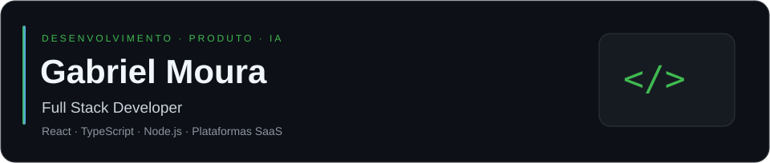
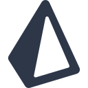
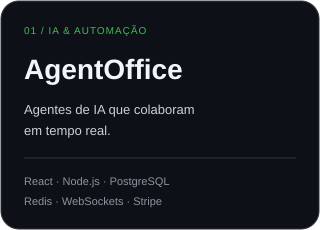
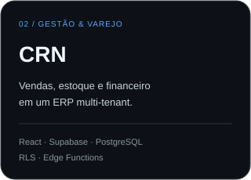
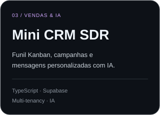

<!-- Envie também as pastas assets, scripts e .github para o repositório. -->

<table>
<tr>
<td width="25%" align="center" valign="middle">

  
<strong>Mato Grosso, Brasil</strong> 
Full Stack Developer
</td>
<td width="75%" valign="top">
<h3>Olá, eu sou o Gabriel 👋</h3>

Desenvolvo aplicações web e plataformas <strong>SaaS</strong>, conectando interfaces, dados e processos de negócio.

Trabalho com <strong>React, TypeScript e Node.js</strong>: da experiência do usuário às APIs, autenticação, cobrança e comunicação em tempo real.

Também integro <strong>inteligência artificial</strong> a produtos e automações.

<a href="https://www.linkedin.com/in/gabrielmouram/">LinkedIn ↗</a> &nbsp;·&nbsp; <a href="mailto:gabrielmouramendes@hotmail.com">Email ↗</a> &nbsp;·&nbsp; <a href="https://github.com/GabrielMMoura?tab=repositories">Repositórios ↗</a>

</td>
</tr>
</table>

## Stack & ferramentas

<table>
<tr>
<td width="50%" valign="top">
<h3>Frontend</h3>

 &nbsp;  &nbsp;  &nbsp; 

React · Next.js · TypeScript · Tailwind CSS

Interfaces responsivas, dashboards e fluxos interativos.
</td>
<td width="50%" valign="top">
<h3>Backend & dados</h3>

 &nbsp;  &nbsp;  &nbsp;  &nbsp; 

Node.js · PostgreSQL · Prisma · Redis · Supabase

Fastify, APIs REST, WebSockets e modelagem de dados.
</td>
</tr>
<tr>
<td valign="top">
<h3>Infraestrutura & qualidade</h3>

 &nbsp;  &nbsp;  &nbsp;  &nbsp; 

Docker · Kubernetes · GitHub Actions · Vitest · Playwright

CI/CD, testes automatizados e observabilidade.
</td>
<td valign="top">
<h3>IA & integrações</h3>

<strong>OpenAI API · Claude API · Gemini API</strong>

LangChain · pgvector · Integrações com APIs

Agentes, orquestração e automação de fluxos de negócio.
</td>
</tr>
</table>

## Projetos em destaque

<table>
<tr>
<td width="33%" valign="top">

Orquestração de agentes e fluxos automatizados.

🔒 Repositório privado
</td>
<td width="33%" valign="top">

Gestão de varejo com vendas, estoque, financeiro e emissão fiscal.

🔒 Repositório privado
</td>
<td width="33%" valign="top">

CRM para SDR com separação de dados por organização.

<a href="https://github.com/GabrielMMoura/mini-crm-sdr-ai">Explorar código ↗</a>
</td>
</tr>
</table>

## Conquistas no GitHub

<table>
<tr>
<td align="center" width="33%">
 
<strong>Pull Shark</strong>
</td>
<td align="center" width="33%">
 
<strong>Pair Extraordinaire</strong>
</td>
<td align="center" width="33%">
 
<strong>YOLO</strong>
</td>
</tr>
</table>

<!-- Emblemas conferidos no perfil em 18/09/2026. Atualizar manualmente quando houver novas conquistas. -->

## Histórico de contribuições

O calendário reúne contribuições reconhecidas pelo GitHub, incluindo commits, pull requests e outras atividades; não representa apenas commits.

[Ver atividade no perfil ↗](https://github.com/GabrielMMoura?tab=overview) &nbsp;·&nbsp; [Histórico de commits do Mini CRM ↗](https://github.com/GabrielMMoura/mini-crm-sdr-ai/commits)

<strong>Experiência, idiomas & certificações</strong>

| Período | Atuação |
| :--- | :--- |
| 2024–2025 | **BinaryXZ** · Desenvolvedor de Software |
| 2023–2024 | **Naveo** · Desenvolvedor Full Stack |
| 2022–2023 | **UniLaSalle** · Desenvolvedor de Software |

**Idiomas:** Português nativo · Inglês para comunicação profissional.

**Certificações:** Database Fundamentals · Responsive Design & UX/UI · API Integrations.

---

<strong>Vamos conversar sobre tecnologia e produtos?</strong>  
<a href="mailto:gabrielmouramendes@hotmail.com">gabrielmouramendes@hotmail.com</a> &nbsp;·&nbsp; <a href="https://www.linkedin.com/in/gabrielmouram/">LinkedIn</a>

